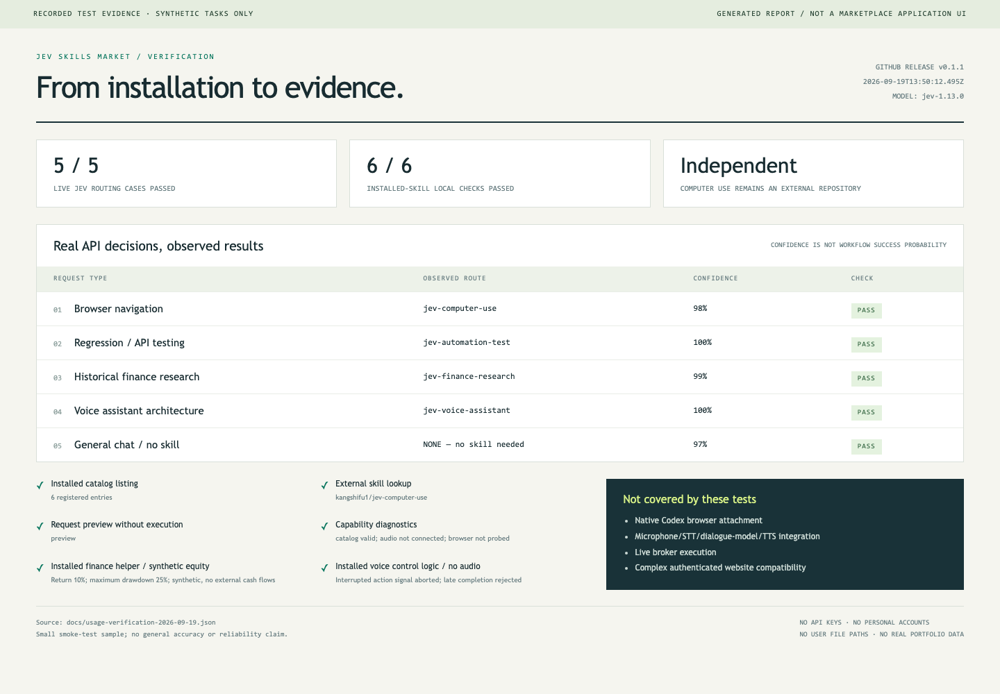

# Jev Skills Market

**一个面向自动化、软件测试、金融研究和语音助手的 Jev 技能市场。**

以 TypeSafe 的 Skill 形式组织可安装能力，提供助手入口、技能目录和可测试的辅助工具。
首个登记的技能是独立项目 [Jev Computer Use](https://github.com/kangshifu1/jev-computer-use)。
社区项目，与 TypeSafe、OpenAI 无隶属关系。

> v0.1.2 是仓库形式的技能市场与助手开发预览，不是已上线的商店网站或完整聊天客户端。

## 安装后的使用实测与截图

已在隔离目录从 GitHub 安装 **v0.1.1 的五个 Skill**。真实 Jev 路由 **5/5 通过**，覆盖浏览器、
自动化测试、金融研究、语音架构和普通聊天；另有 **6/6 本地使用检查通过**，包括目录、
外部技能查询、预览、诊断、金融计算和语音打断逻辑。

下图是**根据实际测试 JSON 生成的证据报告截图**，不是已上线的市场应用界面。
所有任务、金融数据均为合成数据，不包含账户、密钥或用户文件路径。



[测试矩阵与未覆盖范围](docs/TESTING.md) · [原始脱敏记录](docs/usage-verification-2026-09-19.json) · [报告渲染脚本](scripts/render-evidence.mjs)

Computer Use 新增[相同适配器下的耗时比较](https://github.com/kangshifu1/jev-computer-use/blob/main/docs/BENCHMARK.md)：
同一合成三步任务各测三轮，Jev 执行与核验中位数 2.21 秒，含浏览器启动与页面加载的总时间
中位数 **4.41 秒**；当前 Codex 会话逐步调用相同适配器分别为 25.82 秒、**27.06 秒**，
均 3/3 通过。总时间不含测试工具准备、关闭浏览器和写报告；Codex 时间包含思考与工具往返。
**Codex 原生 Browser Skill 仍未测**。

## 两个仓库，各自独立

| 仓库 | 负责什么 |
| --- | --- |
| [jev-computer-use](https://github.com/kangshifu1/jev-computer-use) | 浏览器引擎、Chrome／Chromium 适配器、Computer Use Skill、独立版本 |
| **jev-skills-market** | 技能登记与发现、助手调度、测试／金融／语音工作流 |

市场只登记 Computer Use 的地址和发布版本，不包含其运行时代码。Computer Use 可以独立安装，
也可被其他助手调用；这里的技能不会依赖另一个仓库的本地相对路径。

## 安装

```sh
# 安装本仓库中的五个 Skill；可在安装器里选择
npx skills add https://github.com/kangshifu1/jev-skills-market/tree/v0.1.2 -g -a codex

# 单独安装首个外部技能
npx skills add https://github.com/kangshifu1/jev-computer-use/tree/v0.1.1 --skill jev-computer-use -g -a codex
```

如果只需要助手入口，可加 `--skill jev-assistant`。其他工作流技能按需安装。
使用支持插件市场的 Codex CLI 时，也可选择原生插件形式，二者选一种以免重复：

```sh
codex plugin marketplace add kangshifu1/jev-skills-market
codex plugin add jev-assistant@jev-skills-market
```

原生插件包含本仓库的五个 Skill；外部 Computer Use 仍需独立安装。
安装不会自动建立浏览器连接、配置 API 凭据或连接语音服务。

## 技能目录

| 技能 | 作用 | 交付状态 |
| --- | --- | --- |
| **jev-computer-use** | Jev 决策与浏览器操作，独立仓库 | 外部开发预览 |
| **quantskills** | 发现因子、回测、数据质量与风险工具；接入本市场 Jev 路由 | 外部资源目录，非可直接安装 Skill |
| **jev-assistant** | 组合工作流，发现适合的技能 | 指引＋可执行路由 CLI |
| **jev-automation-test** | 回归／冒烟／接口测试，证据与断言 | 工作流 Skill |
| **jev-finance-research** | 可追溯研究、历史与模拟绩效分析 | 工作流＋本地收益／回撤计算 |
| **jev-voice-assistant** | 语音聊天和工具执行的分层设计 | 架构＋可取消会话状态机 |
| **typesafe-ai** | TypeSafe 官方开发指引，保留来源与许可 | 原文导入 |

机器可读目录：[catalog.json](plugins/jev-assistant/skills/jev-assistant/references/catalog.json)。
目录状态不是安装状态，也不是实测能力承诺。

## 每日发现：2026-09-24（main）

本轮搜索 197 个去重候选，新增 **9 个外部工具**，目录总数为 **137 项**。
以下 Star 为本次 GitHub API 快照，新增项按 `updated_at` 倒序排列。
**仅完成来源核实，未安装或运行上游代码。** 新项目可通过 list/show 查询，暂不加入模型路由。
目录更新位于 main，不包含在既有 v0.1.2 安装快照中。

[本轮审核记录](docs/discovery/2026-09-24.md) · [使用说明](plugins/jev-assistant/skills/jev-assistant/references/external-projects.md)

| 项目 | Star | 已核实的 Jev 用途 |
| --- | ---: | --- |
| [anishfn/shapeshift](https://github.com/anishfn/shapeshift) | 404 | 交互界面演示通过 Jev 对输入意图作类型化判断，再由确定性代码选择界面卡片和计算参数。 |
| [Alex314618-create/JevRev](https://github.com/Alex314618-create/JevRev) | 213 | 智能体工作流工具提供云端 Jev 判断，用于方案筛选、产物证据复核和会话观察；另有回放模式。 |
| [jexp/neo4jev](https://github.com/jexp/neo4jev) | 123 | Neo4j 图导航演示使用 TypeSafe SDK 在相邻关系候选中选择下一步，并进行有界图搜索。 |
| [Liyucheng1997/332_lab-jev-chat](https://github.com/Liyucheng1997/332_lab-jev-chat) | 113 | 仓库的独立 Windows 模块将 UI Automation 或本机 OCR 取得的聊天文本交给 Jev 判断，再可选生成候选回复。 |
| [reticlehq/reticle](https://github.com/reticlehq/reticle) | 827 | 应用验证工具提供 Jev 页面探索驱动，从代码列举的 DOM 动作候选中选择下一步；支持直连与平台代理。 |
| [fstandhartinger/jevbench](https://github.com/fstandhartinger/jevbench) | 105 | 类型化决策模型评价工具包含 TypeSafe Jev 原生 API 适配器；未在本市场运行或复现上游榜单。 |
| [2FastLabs/agent-squad](https://github.com/2FastLabs/agent-squad) | 7,770 | 多智能体框架在 Python 和 TypeScript 中提供 JevClassifier，用类型化 Choice 请求选择目标智能体。 |
| [yunzeforbetter/CastFlow](https://github.com/yunzeforbetter/CastFlow) | 109 | 开发框架提供默认关闭的 Jev 模块分类器，仅对结构规则无法判断的候选模块请求模型判断。 |
| [sonnylazuardi/superterminal](https://github.com/sonnylazuardi/superterminal) | 101 | 终端应用提供可选 Jev 自然语言面板检索，将查询与候选行交给 TypeSafe 或 OpenCode Zen 的 Jev 后端排序。 |

例如 `npm run jev -- show neo4jev`、`npm run jev -- show agent-squad-jev` 可查看具体提交与上游用法。
本轮均为独立工具、框架或应用，`install: null`；不会生成虚构的 Skill 安装命令。

## 每日发现：2026-09-23（main）

本轮搜索 185 个去重候选，98 个已有条目或来源；新增 **23 个外部工具**，市场共 **128 项**。
Star 为本次 GitHub API 检查快照，新增项按 `updated_at` 倒序排列。
**只核实来源，未安装或运行上游代码。** 新增项可通过 list/show 查询，暂不加入模型路由。
以下更新位于 main，不包含在既有 v0.1.2 安装快照中。

[本轮审核记录](docs/discovery/2026-09-23.md) · [使用说明](plugins/jev-assistant/skills/jev-assistant/references/external-projects.md)

| 项目 | Star | 已核实的 Jev 用途 |
| --- | ---: | --- |
| [monteduro/killmyidea](https://github.com/monteduro/killmyidea) | 102 | 创业想法评价演示将多个评分问题交给 Jev，再由代码计算综合分和分类结果。 |
| [jev-chat/jev-chat-jarvis-mac](https://github.com/jev-chat/jev-chat-jarvis-mac) | 173 | macOS 聊天辅助工具提供可选云端 Jev 判断层；默认本地模型与云端 Jev 是不同后端。 |
| [miuuyy/Astra-Ares](https://github.com/miuuyy/Astra-Ares) | 145 | Codex 辅助路由工具使用 Jev 判断有界任务状态，选择后续模型调用的思考深度。 |
| [ipenywis/laya-ultrafast](https://github.com/ipenywis/laya-ultrafast) | 114 | 浏览器工具默认使用本地 Laya，同时保留上游 TypeSafe Jev 云端决策模式。 |
| [Devin-AXIS/jev-dsh-decision](https://github.com/Devin-AXIS/jev-dsh-decision) | 111 | Agent Harness 插件通过 Jev 选择工具、Skill 和任务负责人，并提供结构化质量判断。 |
| [genspark-ai/genoffice](https://github.com/genspark-ai/genoffice) | 7,509 | 办公套件的文件搜索可选将检索候选发送给 TypeSafe Jev 进行相关性重排。 |
| [vinilana/jev-gateway](https://github.com/vinilana/jev-gateway) | 175 | 编程智能体网关调用 Jev 辅助工具选择，支持 TypeSafe 直连及独立网关凭据。 |
| [Horace-Maxwell/horosa-skill](https://github.com/Horace-Maxwell/horosa-skill) | 419 | 术数工具集提供默认关闭的 Jev 决策层，用于有界技法路由等判断；不验证术数结论。 |
| [jev-chat/jev-chat-windows](https://github.com/jev-chat/jev-chat-windows) | 252 | Windows 聊天辅助工具对本地 OCR 文本调用 Jev 判断意图和情绪，提供候选回复。 |
| [Zefan-Cai/Open-Jev](https://github.com/Zefan-Cai/Open-Jev) | 205 | 本地替代模型仓库包含调用 TypeSafe 官方 Jev API 的延迟比较脚本；仅登记该评价入口。 |
| [dorkitude/webctl](https://github.com/dorkitude/webctl) | 120 | 搜索 CLI 使用 Jev 筛选搜索结果、判断重复项，并可对网页文本片段评分。 |
| [HarnessRouter/SystemOneHarness](https://github.com/HarnessRouter/SystemOneHarness) | 102 | 将有界环境动作转成类型化问题的智能体循环，提供 TypeSafe 和 OpenRouter Jev 后端。 |
| [wdobry/laya-playground](https://github.com/wdobry/laya-playground) | 125 | 本地 Laya 演示项目包含真实调用 Jev 的对照评价脚本；未复现上游基准结果。 |
| [confident-ai/deepeval](https://github.com/confident-ai/deepeval) | 18,398 | 评价框架包含 TypeSafe System One 模型适配器和 JevEval 指标，支持同步与异步 SDK 请求。 |
| [supercorp-ai/supercov](https://github.com/supercorp-ai/supercov) | 105 | 代码质量与测试覆盖工具使用 Jev 对源码评分，辅助选择待测试或重构位置。 |
| [TianyuCodings/JevHarness](https://github.com/TianyuCodings/JevHarness) | 141 | 由生成模型编写任务专用执行框架，再通过 Jev 的类型化调用做运行时判断，支持轨迹评价。 |
| [aowang-ai/jev-trade](https://github.com/aowang-ai/jev-trade) | 109 | Hyperliquid 交易项目使用 TypeSafe SDK 请求 Jev 判断买入、卖出或持有；本市场未接账户或下单。 |
| [davide-desio-eleva/kirograph](https://github.com/davide-desio-eleva/kirograph) | 151 | 代码知识图谱工具可选使用 Jev 判断记忆关系、Wiki 矛盾与认证特征。 |
| [ENTERPILOT/GoModel](https://github.com/ENTERPILOT/GoModel) | 1,180 | Go AI 网关实现原生 System One 透传，可连接 TypeSafe Jev；本地兼容服务单独配置。 |
| [sdras/jev-webmcp-extension](https://github.com/sdras/jev-webmcp-extension) | 101 | Chrome 扩展让 Jev 根据页面 WebMCP 工具定义选择工具并填充候选参数。 |
| [CTNicholas/jev-workflow-builder](https://github.com/CTNicholas/jev-workflow-builder) | 132 | 基于 Liveblocks 的多人工作流编辑演示，将 Jev 类型化判断与生成模型节点组合。 |
| [mrnugget/jev-shell-history](https://github.com/mrnugget/jev-shell-history) | 101 | zsh 自动建议插件使用 Jev 对历史命令候选排序，启用时会向提供商提交相关上下文。 |
| [umputun/tg-spam](https://github.com/umputun/tg-spam) | 446 | Telegram 反垃圾工具提供可选 Jev 判断后端，由本地阈值将概率转成分类结果。 |

例如 `npm run jev -- show genoffice`、`npm run jev -- show deepeval-jev` 可查看固定提交与使用来源。
本轮均为独立工具或依赖专属运行时的插件，`install: null`；不会将它们当成单独 Skill 安装。

已收录的 Android 项目 `Finderchangchang/jev-chat-JARVIS` 迁移为 `jev-chat/jev-chat-jarvis`；
当前 GitHub 仓库 ID 相同，已登记 `repositoryAliases`，不重复增加条目。

## 每日发现：2026-09-22（main）

本轮搜索 146 个去重候选，其中 72 个已登记来源；复核其余 74 个，新增 **27 个外部项目**。
以下按本次 GitHub API 的 `updated_at` 倒序列出，Star 为本次检查快照。
**只完成来源核实，未安装或运行上游代码。** 新条目可通过 list/show 查询，暂不加入模型路由。
更新位于 main，不包含在现有 v0.1.2 安装快照中。

[本轮审核记录](docs/discovery/2026-09-22.md) · [使用说明](plugins/jev-assistant/skills/jev-assistant/references/external-projects.md)

| 项目 | Star | 类型 | 已核实的 Jev 用途 |
| --- | ---: | --- | --- |
| [Finderchangchang/jev-chat-JARVIS](https://github.com/Finderchangchang/jev-chat-JARVIS) | 942 | 工具 | Android 聊天辅助应用通过 OpenRouter 调用 Jev，对聊天文本分类并排列候选回复。 |
| [dealerdefi/Jevmind](https://github.com/dealerdefi/Jevmind) | 164 | 工具 | CLI 和 MCP 工具集提供可选 Jev HTTP 判断后端；上游标注该适配器仅做过模拟传输测试。 |
| [xerj-org/xerj](https://github.com/xerj-org/xerj) | 2,260 | 工具 | 搜索服务可选将检索结果文本发送给 Jev 评分和重排；本地兼容模型是独立后端。 |
| [Arize-ai/phoenix](https://github.com/Arize-ai/phoenix) | 11,565 | 工具 | 可观测性平台通过 OpenInference 插桩接收 TypeSafe System One 调用追踪；官方文档提供实际 SDK 接入示例。 |
| [jerryjliu/docjev](https://github.com/jerryjliu/docjev) | 192 | 工具 | 本地文档解析后使用 Jev 判断文档类别和拆分边界，提供 Python 库、CLI 与本地应用。 |
| [wquguru/dasheng](https://github.com/wquguru/dasheng) | 111 | 工具 | 英语朗读工具经 ZenMux 调用 Jev，判断转写词语是否匹配及错误类别；不评价声学发音。 |
| [0xNatoshi/jev-codex-router](https://github.com/0xNatoshi/jev-codex-router) | 173 | 工具 | 本地路由服务使用 Jev 为 Codex 模型调用选择模型档位和思考深度，依赖上游路由运行时。 |
| [RomanSlack/jev-drone](https://github.com/RomanSlack/jev-drone) | 112 | 工具 | MuJoCo 无人机模拟器从相机提取结构化场景，使用 Jev 辅助飞行状态判断，再由代码控制动作。 |
| [FBddcz/embodied-jev](https://github.com/FBddcz/embodied-jev) | 163 | 工具 | MuJoCo 机器人工作台提供 TypeSafe Jev 决策后端，向 Jev 发送结构化文本状态。 |
| [kevinbadi/hyperedit](https://github.com/kevinbadi/hyperedit) | 171 | 工具 | 视频编辑项目接入 Jev 选择编辑工作流和媒体候选，具体调用位于服务端脚本。 |
| [FerryCorleone/crush-monitor](https://github.com/FerryCorleone/crush-monitor) | 114 | 工具 | 聊天文本分析工具使用 TypeSafe SDK 批量请求 Jev 的情绪、意图和回复评价。 |
| [vinilana/jev-eval-agent](https://github.com/vinilana/jev-eval-agent) | 103 | 工具 | 比较直接工具选择与 Jev 预先选择工具的智能体评价项目，Jev 通过 SDK 发出真实请求。 |
| [tinyhumansai/opencompany](https://github.com/tinyhumansai/opencompany) | 196 | 工具 | 多智能体运行时通过 TinyHumans 的 System One 代理请求 Jev，选择发言和任务转交目标。 |
| [kitfunso/hippo-memory](https://github.com/kitfunso/hippo-memory) | 752 | 工具 | 智能体记忆工具提供默认关闭的 Jev 检索重排器，启用时发送候选文本给 TypeSafe。 |
| [timpratim/macbrow](https://github.com/timpratim/macbrow) | 113 | 工具 | 语音 Mac 与浏览器控制工具使用 Jev 选择工具和参数，并可转交 jev-ultrafast 执行浏览器步骤。 |
| [comet-ml/opik](https://github.com/comet-ml/opik) | 22,183 | 工具 | 可观测性平台包含 TypeSafe Python SDK 插桩，追踪同步与异步 System One 调用。 |
| [CatCatUncle/openworkbuddy](https://github.com/CatCatUncle/openworkbuddy) | 173 | 工具 | 本地办公助手通过 TypeSafe 或 OpenRouter 请求 Jev，提供判断接口和目标验收功能。 |
| [mohsen1/llm-debugger-vscode-extension](https://github.com/mohsen1/llm-debugger-vscode-extension) | 359 | 工具 | VS Code 调试扩展通过 Jev 判断下一步调试动作，生成模型承担代码生成等工作。 |
| [Dicklesworthstone/skillranker](https://github.com/Dicklesworthstone/skillranker) | 108 | 工具 | Rust CLI 使用实时会话上下文请求 Jev，为下一步选择和排序技能。 |
| [anton-abyzov/specweave](https://github.com/anton-abyzov/specweave) | 163 | 工具 | 开发工作流工具内置 Jev HTTP 客户端与命令，支持有界类型化判断和浏览器候选选择。 |
| [truespar/sentio](https://github.com/truespar/sentio) | 246 | 工具 | 邮件平台提供可选 TypeSafe Jev 分类后端，对邮件作结构化标签判断。 |
| [morganlinton/Albatross](https://github.com/morganlinton/Albatross) | 230 | 工具 | 终端编程智能体提供默认关闭的 Jev 判断模式，可先观察判断结果再启用受限直接回答。 |
| [kunpengtalk/OmniStudio](https://github.com/kunpengtalk/OmniStudio) | 144 | 工具 | 模型工作台提供本地与云端 System One 后端，可用自有凭据连接 TypeSafe；本地模型不等于 Jev。 |
| [LnYo-Cly/ai4j](https://github.com/LnYo-Cly/ai4j) | 429 | 工具 | Java SDK 接入 TypeSafe System One，提供类型化问题、判断路由与护栏接口。 |
| [oficcejo/aiagents-stock](https://github.com/oficcejo/aiagents-stock) | 1,942 | 工具 | 股票研究工具可选调用 Jev 返回评级和新闻情绪等结构化结果；本市场未接账户或执行交易。 |
| [OneWave-AI/claude-skills](https://github.com/OneWave-AI/claude-skills) | 301 | 集合/目录 | Skill 集合包含 Jev 接入、审查与评价工作流，以及真实调用 Jev 的标准和阈值扫描脚本。 |
| [JamesANZ/medical-mcp](https://github.com/JamesANZ/medical-mcp) | 113 | 工具 | 医学文献 MCP 服务提供可选 Jev 检索重排，对问题与文献摘要的匹配程度作判断。 |

例如 `npm run jev -- show docjev`、`npm run jev -- show macbrow` 返回固定提交、证据和上游用法。
本轮工具及集合均返回 `install: null`；它们需要各自独立的运行环境。

## 每日发现：2026-09-21（main）

本轮检查 109 个去重候选，新增 **71 个独立外部项目**。Star 为检查时的 GitHub API 快照，
按 GitHub `updated_at` 倒序排列；最近推送时间、许可证、提交和证据均保存在机器目录。
**以下项目只完成来源核实，未安装或运行。** `list` / `show` 可查询；暂不加入模型路由候选。
这些新增项位于 `main`，不包含在现有 `v0.1.2` 安装快照中。

[本轮审核记录](docs/discovery/2026-09-21.md) · [使用说明](plugins/jev-assistant/skills/jev-assistant/references/external-projects.md)

| 项目 | Star | 类型 | 已核实的 Jev 用途 |
| --- | ---: | --- | --- |
| [Sac-Y/Jev-cu](https://github.com/Sac-Y/Jev-cu) | 469 | 工具 | Jev 从界面文字候选中选择操作，宿主 Computer Use 执行；Skill 依赖仓库根目录脚本。 |
| [itsmostafa/typesafe-mcp](https://github.com/itsmostafa/typesafe-mcp) | 134 | 工具 | Go MCP 工具将 TypeSafe Jev 的概率判断提供给智能体宿主。 |
| [browser-use/jev-ultrafast](https://github.com/browser-use/jev-ultrafast) | 11,789 | 工具 | Jev 选择浏览器操作与目标元素，文本填写交给独立语言模型。 |
| [jarrodwatts/jev-trader](https://github.com/jarrodwatts/jev-trader) | 1,526 | 工具 | 可选 Jev 订单簿决策适配器；默认模型为 mock，市场未启用交易或复现收益。 |
| [jaredpalmer/kev](https://github.com/jaredpalmer/kev) | 1,011 | 工具 | 自托管模型仓库包含调用 Jev 的比较评价客户端；不将本地主模型标为 Jev。 |
| [wuyoscar/jev-skill](https://github.com/wuyoscar/jev-skill) | 148 | 集合/目录 | 九个 Jev 工作流 Skill 与调用脚本集合，包含通过 OpenRouter 请求 Jev 的封装。 |
| [rmalde/minecraft-agent](https://github.com/rmalde/minecraft-agent) | 283 | 工具 | 规划模型给出目标，Jev 从 Minecraft 当前状态选择可执行动作。 |
| [tamaratran/fast-jev-compaction](https://github.com/tamaratran/fast-jev-compaction) | 5,147 | 工具 | Claude Code 插件使用 Jev 判断应保留的工具调用和结果，处理会话上下文。 |
| [Anil-matcha/awesome-jev-by-typesafe](https://github.com/Anil-matcha/awesome-jev-by-typesafe) | 705 | 集合/目录 | Jev 用例和开发示例目录，包含实际调用 TypeSafe SDK 的 Python 入门代码。 |
| [superagents-lab/jev-search](https://github.com/superagents-lab/jev-search) | 299 | 工具 | Jev 选择搜索来源与查询参数，并对 Search1API 返回的结果评分。 |
| [bespokelabsai/nimble](https://github.com/bespokelabsai/nimble) | 1,092 | 工具 | 本地模型研究仓库包含使用 TypeSafe Jev API 评价公共基准的独立脚本。 |
| [uehaj/jev-semgrep](https://github.com/uehaj/jev-semgrep) | 117 | 工具 | 使用 Jev 按语义评价文本行，支持跨语言的意义搜索。 |
| [kerpopule/hermes-jev-skills](https://github.com/kerpopule/hermes-jev-skills) | 253 | 工具 | Hermes 的 Jev 插件与 Skill 集合，覆盖模型路由、上下文和浏览器操作；需上游运行时。 |
| [OpenAgentsInc/openagents](https://github.com/OpenAgentsInc/openagents) | 450 | 工具 | 在智能体回合中使用 Jev 的类型化判断选择响应与工作流程。 |
| [lakeday-org/perch](https://github.com/lakeday-org/perch) | 165 | 工具 | 以 Jev 的结构化问题实现语义代码检查和自定义规则检查。 |
| [TianyuCodings/NanoJev](https://github.com/TianyuCodings/NanoJev) | 1,392 | 工具 | 本地主模型以外，仓库包含真实 Jev API 游戏比较脚本；仅收录其 Jev 评价能力。 |
| [tamaratran/jev-pruner](https://github.com/tamaratran/jev-pruner) | 128 | 工具 | Claude Code 插件在命令完成后使用 Jev 筛减 Bash 输出。 |
| [kyotofin/tax-doc-classifier](https://github.com/kyotofin/tax-doc-classifier) | 298 | 工具 | 将税务文档页面文本交给 Jev 判断表单类型与页面类别；未复现上游准确率声明。 |
| [realZachi/pg-jev](https://github.com/realZachi/pg-jev) | 248 | 工具 | PostgreSQL 扩展通过 Jev 对数据行进行语义筛选、分类和排序。 |
| [NiazMorshed2007/jev-review](https://github.com/NiazMorshed2007/jev-review) | 183 | 工具 | 本地 MCP 服务使用 Jev 对代码质量维度给出结构化评分。 |
| [jkudish/jev-mcp](https://github.com/jkudish/jev-mcp) | 158 | 工具 | 通过 MCP 向智能体提供 TypeSafe Jev 的类型化判断与概率结果。 |
| [thruwire/foreman](https://github.com/thruwire/foreman) | 438 | 工具 | 使用 Jev 观察开发任务状态，辅助识别阻塞与需要独立验证的工作。 |
| [JoasASantos/NeuroSploit](https://github.com/JoasASantos/NeuroSploit) | 1,370 | 工具 | 安全测试框架的可选 Jev 发现项复核层；本市场仅登记，不执行安全测试。 |
| [devagrawal09/jev-review](https://github.com/devagrawal09/jev-review) | 409 | 工具 | Jev 对 Git 差异或代码库进行有界审查，配有本地结果看板。 |
| [OpenByteInc/QuantDinger](https://github.com/OpenByteInc/QuantDinger) | 11,836 | 工具 | 交易平台包含可选 Jev 交易前判断层；本市场未连接账户或执行订单。 |
| [ekzhang/openjev-sglang](https://github.com/ekzhang/openjev-sglang) | 223 | 工具 | 自托管模型仓库的 BoolQ 脚本支持通过 OpenRouter 调用真实 Jev 做比较评价。 |
| [logan-markewich/jeff](https://github.com/logan-markewich/jeff) | 168 | 工具 | 自托管模型仓库包含面向 TypeSafe 官方端点的 JevBench 比较入口。 |
| [droidrun/mobile-jev](https://github.com/droidrun/mobile-jev) | 275 | 工具 | Jev 选择 Android 操作，由 Mobilerun API 执行，提供工作室和 CLI。 |
| [BillionsBobby/JevRouter](https://github.com/BillionsBobby/JevRouter) | 114 | 工具 | Jev 从模型、工具和智能体候选中选择目标，上游代码处理可用性与执行约束。 |
| [kitze/skillbox](https://github.com/kitze/skillbox) | 215 | 工具 | 自托管技能库的可选 Jev 推荐，通过用户配置的 TypeSafe 或网关提供商调用。 |
| [notque/vexjoy-agent](https://github.com/notque/vexjoy-agent) | 421 | 工具 | 以 Jev 分类请求并选择智能体、Skill 或流水线的可选路由。 |
| [sutro-sh/jev-align](https://github.com/sutro-sh/jev-align) | 237 | 工具 | 围绕 Jev 与人类反馈构建和校准 AI 判断函数的实验性 CLI。 |
| [brainstormity/Jev-X-Sentiment-Analysis](https://github.com/brainstormity/Jev-X-Sentiment-Analysis) | 133 | 工具 | 加密市场舆情应用的 TypeSafe Jev 评价层；未接入个人数据或执行分析任务。 |
| [typesafe-ai/typesafe-sdk-python](https://github.com/typesafe-ai/typesafe-sdk-python) | 149 | 工具 | TypeSafe 维护的 Python SDK，提供 System One 类型化请求客户端。 |
| [standardagents/jevpilot](https://github.com/standardagents/jevpilot) | 122 | 工具 | 驾驶模拟器向 Jev 提交道路状态和候选路径，由本地代码完成控制计算。 |
| [moritzkremb/jev-voice-browser](https://github.com/moritzkremb/jev-voice-browser) | 164 | 工具 | 语音浏览器应用使用服务端 Jev 判断转写文本的意图、目标和完成状态。 |
| [kunchenguid/compact-adviser](https://github.com/kunchenguid/compact-adviser) | 149 | 工具 | 使用 Jev 判断会话是否到达适合压缩的工作边界。 |
| [fhshaik/typesafe-mario](https://github.com/fhshaik/typesafe-mario) | 298 | 工具 | 实验性模拟器控制器使用 Jev 从合法手柄动作中选择下一步。 |
| [dabit3/jev-experiments](https://github.com/dabit3/jev-experiments) | 339 | 集合/目录 | 多个独立 Jev 应用示例，已查看其中客服辅助示例的 SDK 调用。 |
| [jkudish/jev-browser](https://github.com/jkudish/jev-browser) | 180 | 工具 | Jev 从网页控件选择动作，浏览器循环提供 CLI、MCP 和库接口。 |
| [AgentiLoop/Agent](https://github.com/AgentiLoop/Agent) | 617 | 工具 | Mac 智能体在已有硬规则后，可选调用 Jev 评价 shell 命令的数据破坏风险。 |
| [nicobailon/pi-interactive-shell](https://github.com/nicobailon/pi-interactive-shell) | 587 | 工具 | Pi 交互终端的可选 Jev 语义监控，需显式开启并配置提供商凭据。 |
| [gargpratyush/jev-router](https://github.com/gargpratyush/jev-router) | 255 | 工具 | Jev 为 Claude Code 或 Codex 的新用户回合选择模型。 |
| [y0usaf/pi-jev](https://github.com/y0usaf/pi-jev) | 122 | 工具 | Pi 扩展提供 Jev 工具调用判断、命令输出判断和类型化问答工具。 |
| [DevMortimer/pi-warden](https://github.com/DevMortimer/pi-warden) | 106 | 工具 | Pi 扩展通过 Jev 检查写入内容与项目规则的符合程度。 |
| [yonatangross/orchestkit](https://github.com/yonatangross/orchestkit) | 278 | 工具 | 工具包包含可选 Jev 会话类别判断，可使用观察模式。 |
| [harness/mcp-server](https://github.com/harness/mcp-server) | 102 | 工具 | Harness MCP 可选调用 TypeSafe 对流水线失败类别提供辅助判断。 |
| [vercel-labs/ai-cli](https://github.com/vercel-labs/ai-cli) | 808 | 工具 | 终端工具提供结构化评价，README 指定 Jev 为默认评价模型。 |
| [devagrawal09/stanley-code](https://github.com/devagrawal09/stanley-code) | 101 | 工具 | Jev 为代码工作流选择路径，并对受限证据作类型化判断。 |
| [narumiruna/pi-extensions](https://github.com/narumiruna/pi-extensions) | 586 | 工具 | Pi 扩展集合提供 Jev 类型化判断、上下文筛选和语义检索。 |
| [coldteadotai/abide](https://github.com/coldteadotai/abide) | 196 | 工具 | 向 Jev 提交项目规则和代码差异，辅助检查规则违反情况。 |
| [kitze/unclutter](https://github.com/kitze/unclutter) | 146 | 工具 | 浏览器扩展使用 Jev 判断页面杂乱元素，并保存可复用规则。 |
| [DecapodLabs/decapod](https://github.com/DecapodLabs/decapod) | 233 | 工具 | 项目治理工具在 assurance.evaluate 中可选请求 Jev 的结构化判断。 |
| [typesafe-ai/typesafe-sdk-js](https://github.com/typesafe-ai/typesafe-sdk-js) | 182 | 工具 | TypeSafe 维护的 JavaScript 和 TypeScript SDK，提供 System One 请求客户端。 |
| [fatwang2/awesome-jev](https://github.com/fatwang2/awesome-jev) | 178 | 集合/目录 | Jev 项目目录在 GitHub 工作流中接入 Jev Review Action 处理提交审查。 |
| [WrongStack/WrongStack](https://github.com/WrongStack/WrongStack) | 329 | 工具 | 编程智能体提供可配置的 Jev 类型化决策工具与可选判断功能。 |
| [juspay/neurolink](https://github.com/juspay/neurolink) | 134 | 工具 | 多提供商 SDK 提供 TypeSafe Jev decide 接口及可选路由与上下文判断。 |
| [dbreunig/building-with-jev-skill](https://github.com/dbreunig/building-with-jev-skill) | 126 | Skill | 可安装的 Jev 编程指引 Skill，覆盖问题设计、状态和结果组合；不提供独立执行器。 |
| [marvikomo/code-lens-ai](https://github.com/marvikomo/code-lens-ai) | 182 | 工具 | 代码分析工具可选使用 TypeSafe Jev 为文件标注架构层。 |
| [nicobailon/pi-mcp-adapter](https://github.com/nicobailon/pi-mcp-adapter) | 1,500 | 工具 | Pi MCP 适配器可选使用 Jev 进行语义搜索和脚本评价。 |
| [rokbenko/quackd](https://github.com/rokbenko/quackd) | 219 | 工具 | 机器人 CLI 的可选 Jev 离散步骤选择器；上游声明尚未完成真实 API 或硬件验证。 |
| [monotykamary/pi-fabric](https://github.com/monotykamary/pi-fabric) | 241 | 工具 | Pi 工具运行时提供 Jev 类型化判断、有界循环和可选浏览器连接。 |
| [liuyanghejerry/Clausura](https://github.com/liuyanghejerry/Clausura) | 203 | 工具 | CI 工具可选使用 Jev 复核发现项，再由确定性规则决定流水线结果。 |
| [MillionSend/millionsend](https://github.com/MillionSend/millionsend) | 166 | 工具 | 邮件平台包含可选异步 Jev 内容评价；本市场未连接邮箱或发送消息。 |
| [delexw/claude-code-trace](https://github.com/delexw/claude-code-trace) | 370 | 工具 | 会话日志查看器可选使用 Jev 评价智能体进展、工具使用和效率。 |
| [calebl/ynab-mcp-server](https://github.com/calebl/ynab-mcp-server) | 141 | 工具 | 预算 MCP 服务可选使用 Jev 提议交易分类；本市场未读取账户或交易记录。 |
| [caliber-ai-org/ai-setup](https://github.com/caliber-ai-org/ai-setup) | 1,276 | 工具 | 开发配置同步工具可选使用 Jev 筛选过期工具上下文。 |
| [Arize-ai/openinference](https://github.com/Arize-ai/openinference) | 1,225 | 工具 | 包含 Python 和 JavaScript TypeSafe SDK 的追踪插桩与调用示例。 |
| [ielab/llm-rankers](https://github.com/ielab/llm-rankers) | 211 | 工具 | 检索研究仓库包含使用 Jev 进行多种文档重排序的实验。 |
| [donvito/ai-backends](https://github.com/donvito/ai-backends) | 146 | 工具 | API 服务通过评价端点提供 TypeSafe Jev Choice、Score 和 Noul 判断。 |
| [cequence-io/openai-scala-client](https://github.com/cequence-io/openai-scala-client) | 248 | 工具 | Scala 多提供商客户端包含 TypeSafe System One 服务接口。 |

在 main 检出目录中运行 `npm run jev -- show jev-voice-browser` 可查看来源和用法。
工具、SDK 和集合返回 `install: null`；安装步骤以固定提交的 `usageUrl` 为准。

## QuantSkills 接入

已登记 [QuantSkills](https://github.com/quantskills/quantskills)，Jev 可将“寻找因子挖掘、IC 评价、回测等量化工具”的请求路由到该目录。
这是**本市场提供的 Jev 路由接入**；尚无证据表明上游目录原生支持 Jev。目录本身没有 `SKILL.md`，
`show quantskills` 会返回来源与 `install: null`，具体项目需按各自许可证、依赖和接口安装。
本次按用户指定收录，未复制上游源码。见 [接入与使用边界](plugins/jev-assistant/skills/jev-assistant/references/quantskills.md)。

后续自动发现按 [每日收录规则](docs/DAILY-DISCOVERY.md)执行；收录不代表项目已通过完整功能测试。

## 运行助手工具

```sh
git clone https://github.com/kangshifu1/jev-skills-market.git
cd jev-skills-market
git checkout v0.1.2
npm ci
npm run jev -- list
npm run jev -- show jev-computer-use
npm run jev -- show quantskills
npm run jev -- route "寻找 QuantSkills 的因子挖掘和 IC 评价工具"
npm run jev -- route "帮我测试浏览器里的报表筛选功能"
npm run demo
```

默认路由只展示将提交给 Jev 的请求，不消耗 API、不伪造推荐结果。
在本地环境安全配置 `TYPESAFE_API_KEY` 后，添加 `--live` 可实际调用 TypeSafe。
路由返回推荐、无匹配或需复核，**不会自动执行推荐技能**。阈值是待评估的启发式参数。

## 语音聊天如何接入


Jev 负责选择动作；对话模型负责连续聊天；STT/TTS 负责音频。
已提供打断、过期结果丢弃、一次性执行和具体动作确认的状态机。实际麦克风、对话模型、
STT/TTS 接口和聊天 UI 尚待接入。见 [语音架构](plugins/jev-assistant/skills/jev-voice-assistant/references/architecture.md)。

金融方向首版聚焦数据与研究，不提供实盘下单。指标工具假定净值已扣除成本且没有外部现金流，
不是完整回测引擎；示例数据为合成数据。

## 贡献与验证

```sh
npm test
npm run validate
# 可选：设置 TYPESAFE_API_KEY 后进行真实 API 测试
npm run test:live
```

注册新技能的流程见 [CONTRIBUTING.md](CONTRIBUTING.md)。独立技能应保留自己的仓库、许可证与
发布版本，市场登记其可核查的能力和依赖。来源校验见 [upstream.lock.json](upstream.lock.json)。
设计记录见 [设计文档](docs/plans/2026-09-19-design.md)，发布说明见 [CHANGELOG.md](CHANGELOG.md)。

v0.1.2 真实 Jev 路由冒烟测试 **6/6 通过**，包括 QuantSkills 中英文发现、金融指标和普通聊天无匹配。见 [本次脱敏记录](docs/quantskills-routing-2026-09-19.json)。八项本地测试与安装后的助手 CLI 检查通过；不代表上游量化工具已执行或完成质量评测。
