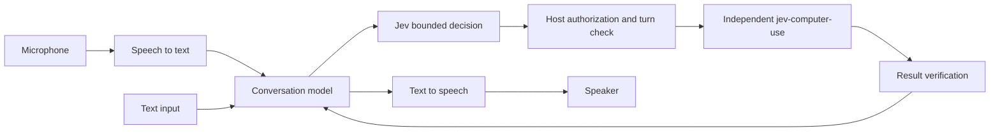

# Voice and chat architecture



The control plane owns turn IDs, cancellation, authorization and execution history.
The data plane owns streaming audio and model/driver requests. Separate them so voice
providers can change without changing the browser runtime or market catalog.

## Adapter contracts

- STT: `transcribe(audioStream, {signal})` emits partial transcripts for display and
  one final transcript for processing. Provider errors keep text input available.
- Dialogue: `respond(messages, {signal, tools})` emits either a spoken reply or a typed
  proposal `{id, effect, summary, parameters}`. Validate parameters in code. The model
  cannot assign itself permissions; the host assigns the effect based on the actual tool.
- Jev: select an action ID from a bounded current set; never generate selectors or code.
- Executor: `execute(action, {signal, turnId})` checks the turn and authorization before
  each step and returns `{verified, evidence, status}`. Wire to the independent browser
  library; do not assume a market-relative file path.
- TTS: `speak(text, {signal})` stops on interruption; never narrate success before evidence.

These contracts are architecture targets; only the state machine is implemented here.
Choose actual SDKs and read their current docs when implementing the adapters.

## Session example

```js
import { VoiceSession } from '../scripts/session.mjs';
const session = new VoiceSession();
const { turnId, signal } = session.begin('Open the daily report');
session.propose(turnId, {id: 'open-report', effect: 'read', summary: 'Open daily report'});
const job = session.takeAction(turnId);
// Adapter must honor job.signal; independently verify the real result.
session.complete(turnId, {verified: true});
session.finishSpeaking(turnId);
```

For `external-write`, call `confirm(turnId, actionId)` after matching user authorization
and before `takeAction`. A new transcript or `interrupt()` aborts old signals and
invalidates old completions. The first step of a future audio UI is to connect stop/mute
and turn status to these transitions, then validate real STT and TTS latency separately.
